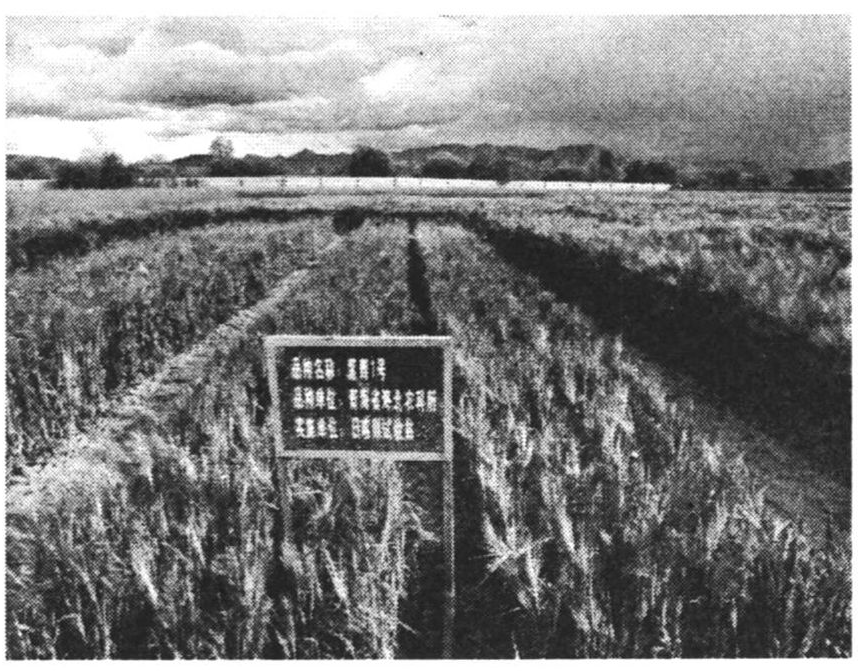
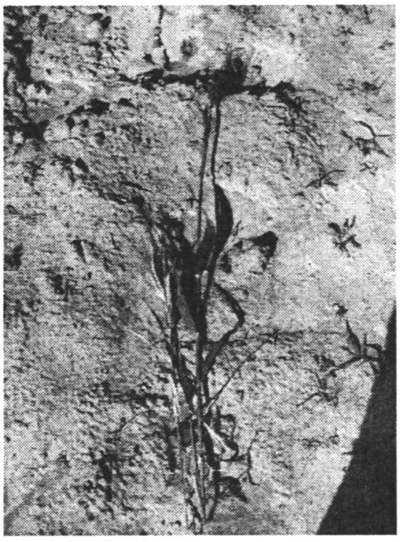
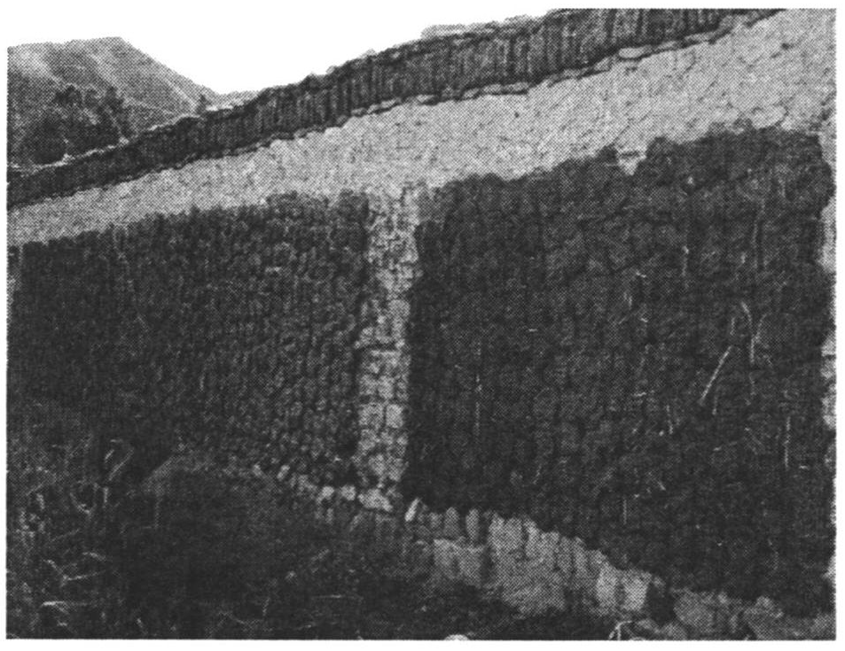
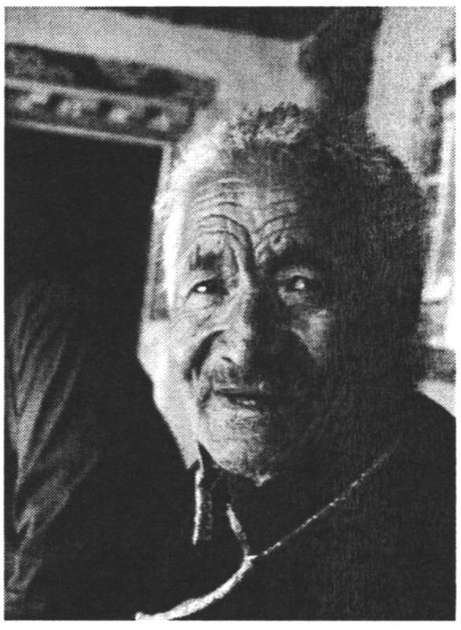
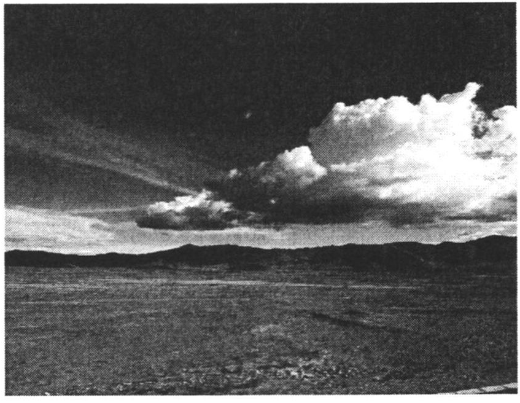
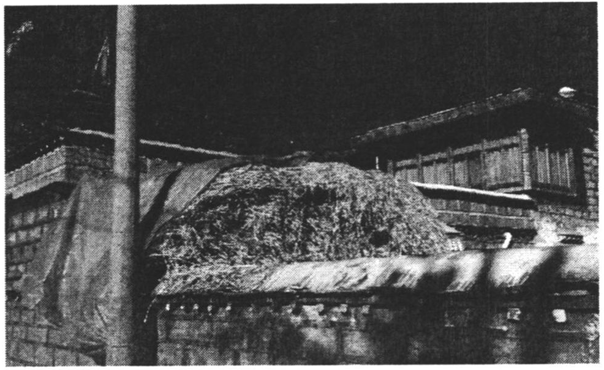

## 第一章：藏族农民的生计传统与西藏的农业技术变迁

### 第一节 文化与技术变迁

“原始落后”、“刀耕火种”、“生产力水平低下”是形容西藏传统农业的常用词汇，并在很大程度上是其真实写照。1951 年，西藏粮食平均亩产按习惯亩计仅 70 余公斤，按标准亩计更是不到 50 公斤[^54]，年人均粮食占有量仅 135 公斤[^55]，尚不能满足基本的生存需求。因而，国家启动了农业现代化，希望通过品种改良、技术革新、农田基础设施建设等手段，改变西藏传统的农业生产方式，增加粮食产量，提高人民生活水平。然而，在其具体进程中，一个令人困惑的现象却是，非常需要粮食的藏族农民却常常会抵制能生产更多粮食的农业新技术。这是为什么？

对此，“文化贫困论”是一个流行的解释，它的提出者刘易斯（Oscar Lewis）认为：“贫困文化一旦形成，就必然倾向于永恒...他们在心理上，不准备接受那些可能改变他们生活的种种变迁的条件或改善的机会[^56]。”国内许多关于贫困地区，特别是关于民族地区贫困问题的研究，顺此思路认为：落后地区之所以难以发展，是因为当地的传统文化不适应现代化，农民落后、愚昧的观念导致了他们无法理解并接受新事物，当地人学会了接受贫困，而不是努力革新。[^57]

如果这一解释是成立的，即本地传统文化观念与现代化是对立的，那么，一切新的、会对生活带来改变的现代技术都应当遭到本地农民的抵制。然而，我在西藏的观察中却发现一个它无法解释的现象：同一类别的新技术，有的被农民坚决抵制了，但另一些却被迅速接受了。我们不禁要追问，为什么农民会有选择性的接受现代技术？本地传统文化观念真的和现代化是对立的吗？进一步而言，“文化贫困论”的范式回答不了这些问题：文化从何而来？文化背后是什么？而只有理解了这些问题，真正理解了文化，我们才能真正了解制约农民在面临现代化时进行行为选择的机制。

何为文化？费孝通指出，文化是共同生活的人群在长期的历史当中逐渐形成并高度认同的民族经验。[^58]文化的合理性和生命力在于对本地环境的认识和对人们生活的指导意义。斯图尔德（Julian Steward）提出文化内核的概念，他认为文化内核就是指文化与所处的自然生态环境之间经过磨合而形成的文化生态耦合体，其内容主要表现为当地居民的生计。[^59]反映在农业经营上的文化观念实际是当地生计模式的外显，而这种生计传统则又受制于本地的自然环境，来源于人与自然数千年的互动实践过程之中。同时，它也能够反作用于生计和环境，并利用由它形成的文化观念和宗教信仰维系自然环境的生态平衡[^60]。

由此而言，农业发展不仅是一个技术问题，某些技术被抵制表面上是因为文化观念的抵制，实则是因为它与本地生计传统以及自然环境的冲突。毋庸置疑，农业技术进步一般都能带来作物产量和经济数据的增长，然而对本地人来说，新技术对传统生计模式的改造很可能使本地人长期赖以生存的资源消失（因为这些资源对增加产量和数据是不起作用的）甚至生态失衡。技术进步给本地人带来的很可能不是生活改善，而是生计破产。[^61]麻国庆在对内蒙古的研究中指出，蒙古族的游牧传统和在此基础上形成的民间环境知识是数千年来维系内蒙古草原生态的关键因素[^62]，而当前内蒙古严重的沙漠化等问题则是由于游牧向定居的经营方式变革过程中民间环境知识的废弃造成的[^63]。陈祥军对新疆哈萨克族地区的研究[^64]，马晓琴、杨德亮对青海藏族牧区的研究[^65]也揭示了类似的事实。因此，我们必须客观的、从本地实际出发去看待新技术和发展，理解本地传统的合理性，而不能盲目崇拜“技术至上”和“发展霸权”。

但是，我们也不能由此走向另一个极端，将发展与传统简单的对立起来，赋予传统合法性地位的同时，将发展定义为破坏，认为现代技术与传统文化必然不相容，新技术带来的改变必然对当地的生计和生态造成损害。实际上，如果盲目的将发展与传统对立，就会产生另外一种“文化决定论”，即与“发展霸权”相对的极端环保主义。在前后两种模式中，人本身都丧失了其主体地位，成为了“发展”或者“传统”的工具。而与它们不同，迈克尔·塞尼（Micheal Cernea）的态度值得借鉴，他通过自己在世行发展部门 30 余年的工作经验指出，人才是最重要的，要从人的角度来看待发展和传统，无论促进发展还是维护传统，它们的目的都必须是让人更幸福的生活。[^66]而由于研究对象的限制，大多数现有研究（它们的研究对象一般是过度现代化的案例）一定程度上忽视了发展对传统的积极意义。因而本文从研究对象的类别上对现有研究也是很好的补充。

就本研究而言，藏族的生计传统有其内在合理性，但并非是田园牧歌般的美好和富足。在世界人口大爆炸的同时，西藏持续数百年的人口减少确凿无疑的展示了其严重的内在危机。传统的生计模式则对此束手无策，反而是某些恰当的新技术能在不破坏生计传统的前提下，为解决其严重的内在危机带来可能。这也就是“什么因素制约着农民对新技术的选择”的根本原因。即：藏族农民独特的农业文化观念来源于以青藏高原特有自然环境为基础的藏族生计传统，这种文化以是否符合本地生计传统为标准，抵制或接受不同的农业新技术。而当被选择过的新技术嵌入进原有的生计模式之后，它又将使生计模式和相应的文化观念发生新的变迁。

### 第二节 被抵制的新品种和被接受的新品种

本文要考察的新技术指的是通过科学育种培育的青稞新品种，青稞是藏族的生活必需品，其播种面积占西藏粮食作物播种总面积的70%以上。种植品种是农业经营中的核心要素，近代以来，育种科学一直是农业发展的根本性动力。通过优势基因的筛选和定向培育，人类获得了在各个方面都远优于传统品种的新品种。根据测算，自和平解放以来，良种选育对西藏粮食增长的贡献率达到40%以上，是所有因素中最高的。[^67]在西藏自治区政府的农业发展经验中，推广良种是最容易被农民接受、成本最低的农业发展措施。[^68]因而，选育好的新品种是西藏农业现代化的根本动力。与此同时，品种的更替也将对传统的生计模式带来前所未有的冲击。

因此，本文以此为考察西藏农业技术变迁的切入点，从民族志的整体图景来考察青藏高原自然环境、藏族传统生计模式如何制约了藏族农民对不同青稞新品种的选择。简言之，本文将介绍并对比两类青稞新品种，它们同为育种科学和国家农业现代化战略的产物，但是命运却截然相反，一类迅速被农民接受，遍布西藏大地，另一类则被农民坚决抵制，至今只能在科学家的试验田中生长。更令人的困惑的是，农民选择的新品种在粮食产量及其他许多指标上都远远逊于他们抵制的新品种。为什么农民会做出看似如此不符合理性的选择呢？

#### （一）两类品种的收益比较

众所周知，好的品种对农业现代化至关重要。那么，什么样的品种是好的品种呢？从世界的普适经验看，植株高度较矮的品种是最符合农业现代化需求的新品种，它的产量远高于植株较高的传统品种，并且具有众多其他优势。在1950年代以来的世界农业革命中，矮秆基因的发现与选育是世界粮食增产的根本性动力。短短几十年，小麦、大麦、水稻等主要粮食作物的植株高度不约而同的从100cm左右下降到了50、60cm[^69]，而与此同时，全世界的粮食产量则从1950年的6.3亿吨增长到了2010年的22.8亿吨，可以说，是矮秆基因将人类从“马尔萨斯循环”中解救了出来。现在，矮秆品种是农业发展的方向不仅是业界的共识，也早已成为公众的常识，在我国，这已经被写入了中学生物教科书。

对作为大麦分支的青稞来说，同样如此。首先，青稞矮秆品种具有更高的籽秆比[^70]，这意味着光合作用产生的能量更多的被转化为籽粒（也就是粮食）而非秸秆。其次，矮秆品种植株粗矮，能适应更大密度的种植，更耐肥水（吸收更多的化肥和水分），增产潜力大；更抗倒伏，减产风险小。特别是在年平均大风日多达100-150天的青藏高原（这一指标5倍于内地），作物的抗倒伏性能尤为重要。第三，矮秆品种由于其形状整齐，更适宜机械收割。联合收割机一天就可以完成数千亩矮秆作物包括收割、脱粒、装袋在内的全部作业。而高秆品种一般只能使用小型收割机或者人工收割，再单独将收获物脱粒、装袋，费时费力。

例如，国内矮秆青稞的代表品种柴青1号，它是当前产量最高的青稞品种，主要种植于青海省格尔木市。其植株不高于70厘米，2011年和2012年，格尔木市青稞平均亩产分别为454.1公斤和468.74公斤[^71]，农户种植青稞每亩的收益在1200元以上[^72]。然而，增产优势如此出众的矮秆品种，却在西藏不见踪影。

> 矮秆的在西藏种是没问题的，试验田里的你也看见了，但是在西藏，它们也就只能在我们的试验田里种种，当参照系，根本推广不出去。老百姓思想上不认可，不接受这类品种。从80年代起，像当时的昆仑1号到现在的柴青1号，我们在不同地区推广了好几次，没一次成功的。老百姓很顽固，只要是秆子矮的，给种子给补贴给化肥，追着屁股后面求，就差没替他把地种了，他们还是不种。
>
> （LL，2012-4-29，科技专家）

图1：试验田是矮秆青稞唯一的种植地（笔者摄）

图2：藏青320和柴青1号（笔者摄）

但是，西藏的农民并不是对所有的新技术都无差别的抵制，现在西藏普遍种植的青稞品种同样是现代化的产物，但这类品种的各方面指标都远逊于矮秆品种。导致这一差异的关键原因在于，这类品种的培育没有依靠筛选矮秆基因，通过降低植株高度来提高粮食产量和其他性能；反而，逆世界潮流而动，进一步选育高秆基因，以西藏（也是国内）种植面积最大的青稞品种藏青320为例，其植株高度达到110-130cm，比传统品种的植株高度90-110cm，还要高20cm[^73]。而它的平均亩产也只有300公斤[^74]，其产量还远不如上世纪70年代初青海省选育成功的矮秆品种昆仑1号，每亩收益仅700余元[^75]。

> 有一年，我去开一个全国的会，有人介绍他们那边今年丰收，（亩产）差不多能有5、600斤。我听了觉得很有趣，5、600斤怎么能是丰收呢？我们这最差最差也得有700多斤。话说回来，他们那的青稞长的胸这么高，产量能高吗？
>
> （LCZ，2012.9.4，格尔木市农业科技干部）

这还没有计算两者之间在人工投入上的巨大差异，格尔木的矮秆品种全部都是机械化种植，每个壮劳力能轻松经营上百亩的农场，而西藏的高秆品种则需要大量的人工劳动，每个壮劳力仅能种植10-20亩，农忙时节更是需要大量帮工。

而在自然条件上，虽然格尔木的海拔更低（2800米），但由于纬度和地形等原因，在对作物生长最重要的生长期平均积温和无霜期长度上，格尔木相较于西藏的主要农业区一江两河流域并无优势。并且，格尔木的土壤条件还要逊于西藏大部分农区，其土地盐碱化严重（格尔木是全国最大的矿物盐产地），2012年就有3721亩耕地（其中3000亩种植青稞）因为地下水位上升带来的盐碱化而不得不弃耕，超过总耕地面积的5%[^76]。80年代初，格尔木青稞的平均亩产不过150公斤，比西藏主要农区同期还低。

显然，现在格尔木青稞产量上的巨大优势主要是由于矮秆品种的优势造成的。[^77]那么，为什么西藏的农民不接受如此出色的新品种呢？

#### （二）两类品种的经营成本比较

对上一问题，舒尔茨的理论是可能的答案，他批判了“文化贫困论”，从经济学视角指出，农业的增长主要取决于现代农业要素的可得到性和价格，农民是理性的，并非无法理解或是不愿意使用新技术，而是由于他们受制于投入和风险，所以要改造传统农业，就需要国家为农民提供廉价的生产性要素。只要国家做到这一点，农民就会迅速响应，最终实现农业技术变迁[^78]。

但是，从事实上看，首先，两类品种的种子价格差不多，并且都不是杂交品种，因而农民可以自己留种。而且对于新品种，国家不但会免费提供种子，还会额外给予15元/亩的良种种植补贴。此外，由于国家多年的建设，西藏可灌溉耕地面积接近总耕地面积的70%，能满足矮秆品种对水源的要求。矮秆品种的抗倒伏性能还远强于高秆品种，因而，矮秆品种的种植风险反而要小于高秆品种。

第二，矮秆品种所需要支出的更多成本主要就是更多的化肥消耗。但是，由于实际上国家已经做到了舒尔茨要求的“提供廉价的生产性要素”，因而高秆品种和矮秆品种在化肥上的成本差异非常小。尿素和磷酸二铵是青藏高原土壤类型下青稞种植所需的主要化肥，一袋尿素（40公斤）国家补贴价是45元（市场价105元左右）；一袋磷酸二铵（50公斤）国家补贴价是75元（市场价180元左右）。西藏农民目前种植高秆品种，亩均的化肥投入大约是30-40元。而按照格尔木种植矮秆品种的施肥标准和西藏的化肥价格，每亩地40公斤尿素和25公斤磷酸二胺，化肥亩均支出不过80元。考虑到格尔木的耕地是近年来新开垦的沙地，地力较差，需要多施肥的因素，实际上，西藏的亩均化肥投入应该在70元以下，实际亩均成本增加不过30元。这显然不是“农民无法承受的经营成本”。

同时，国家补贴的廉价化肥供应非常充足。事实上，西藏主要的化肥经销商西农集团（自治区农牧厅下辖的政策性公司）面临的最大问题不是不能为西藏农业提供足够的廉价化肥，而是廉价化肥常年滞销，很大一部分化肥都被加价（略高于补贴价，远低于市场价）转卖到青海、四川等地销售。

> “我们种地化肥用的多，都到西农（格尔木办事处）去买，西藏化肥有补贴，特别便宜，西藏人脑筋怪得很，不爱用化肥，我们也就沾点光，嘿嘿。”（ZJY，2012.9.4，格尔木市农民）

第三，使用农用机械并不会增加农民的成本，反而是不使用农用机械的成本更高。格尔木种植矮秆品种一般都是使用联合收割机操作，收割、脱粒、装袋的流水线作业。而西藏绝大多数地区仍然坚持人工收割（播种和犁地，两地都是机械化操作）。然而，这并非是因为西藏没有足够的农用机械，也不是因为机械化的成本更高，事实上，高秆品种的人工收割成本要远高于矮秆品种的机械化收割。例如，格尔木机械收割的成本每亩成本仅50元。而由于有国家补贴，西藏农民如果使用联合收割机收割，平均成本仅40元（如果是乡政府或村委会的收割机，只需要30元/亩的成本；而如果是私人收割机，也只需要50元/亩），政府还会另外发放15元/亩的油料补贴。

而在西藏，高秆品种一般只能使用小型收割机，小型收割机的市场价是每亩50元，国家补贴后的价格是每亩30元。但是为了多获取作物秸秆，大部分农户仍然选择雇人手工收割。每个雇工每天工资是50元，由于高海拔干活比较容易疲劳的原因，平均每天只能收割0.8亩[^79]，此外雇主还需要管吃管住，根据藏族风俗，主人提供的饮食“肉、酒、烟要管够，酥油茶随便喝”。因而，1亩地的实际收割成本接近100元。而且另外的脱粒和装袋（小型收割机收割后，也需要另外脱粒和装袋），也还要花费约20元，总计约120元。相比之下，每亩种植高秆品种的收割成本要比矮秆品种高80元，是它们化肥投入差的两倍以上。

即使不以雇工的形式收割青稞，而按照藏族传统的互助组换工方式收割，其成本依然比机械收割高。因为，虽然不用支付货币工资（工资实际上是以劳动力交换形式支付），但是饮食依然要“肉、酒、烟、酥油茶充足供应”[^80]，并且要更好，不计算换工要付出的劳动力，一亩的收割成本也要50元，加上额外的脱粒和装袋支出的成本，收割成本差还是超过了化肥投入差，并且还没有计算农户自己大半个月（给整个换工圈内收割所需的时间）劳作的人工投入。

以上事实表明，实际上国家已经按照舒尔茨的药方去“改造传统农业了”，成本和风险等制约“理性小农”技术革新的瓶颈已经不存在了。但为什么依然没能左右到农民的行为选择呢？

#### （三）来自田野的回答

当舒尔茨的解释无效后，我们需要重新思考这个问题。首先，来看一看田野的回答：

> 问：你们为什么不种矮秆品种呢？它的产量那么高。
>
> 矮的没有草（秸秆），不能种，我们西藏只能种高的，不能打草的（品种）就不是好的（品种）。[^81]

也就是说，在藏族农民的观念中，“草的多少”是评价青稞品种好坏的主要标准。与之相比，“粮食产量”这一普适标准则不那么重要。而且，前文已经介绍了，为了获得秸秆，农民还付出了高额的成本。

不仅种植作物要选择“打草多的”，“爱护草”本身也是当地的一种文化禁忌。

> 怎么能烧秸秆呢？我们这谁家要是烧秸秆，全村人都得骂死他。（WHD，2012-9-2，拉萨市堆龙德庆县农民）

从另一组现象，我们还能进一步看出在藏族农民观念中秸秆的重要性。

> 我们这里秋收，老是因为草（青稞秸秆）闹矛盾，你收了我的草，我拿了你的草，甚至还打架。大家对粮食还没这么在意。（ZQ，2012-8-16，日喀则市农民）
>
> 我刚来西藏的时候（80年代）还奇怪，老百姓怎么把秸秆这种没用的东西看的这么重？现在几十年看多了，也就习惯了。（ZZY，2012-8-15，科技专家）

### 第三节 高原环境与藏族生计的整体性

乍一看，藏族农民关于草（秸秆）的观念非常奇怪，种植农作物的目的显然应该是收获粮食，怎么变成了收获秸秆？秸秆不是废物么？在我国的一般经验中，秸秆不仅没有任何利用价值，反而会引发带来许多治理问题。国内处理秸秆的主要方式是焚烧，并导致了多地每年春秋两季严重的灰霾天气。[^82]为了治理这一问题，政府煞费苦心，例如上海市政府为了不让农民焚烧秸秆，在上海世博会期间投入上亿元，亩均投入超过120元，才取得了一定效果，然而到了世博会结束之后，问题又再度反弹[^83]。看似不起眼的秸秆却是我国基层治理、农业经济与环境保护三个领域的大难题[^84]。

那么，为什么秸秆这一在全国大多数地区都是负价值的物品到了西藏却成了炙手可热的资源？是什么原因秸秆成为了藏族农民观念中的宝贝了呢？

要回答这一问题，就必须去看制约藏族农民选择品种的整个生计传统和自然环境，理解秸秆对于藏族生计的重要意义，才能真正理解这种观念的实质内核以及制约农业技术变迁的决定因素。

不同生计模式的实质是人类适应多样化自然环境的结果。秸秆之所以重要，关键在于它在藏族生计模式中具有的不可替代的作用。“农牧结合”是藏族农民特有的生计模式，它的意义并不能简单从经济角度去理解，即所谓的既种粮食又养猪的多种经营。它实质上是藏族农民几千年来基于高原环境的实践形成的一套农与牧之间复杂精密的生计模式。青稞种植和牛羊养殖是它的两大基石，两者之间互相支撑，形成了“以牧补农，以农养牧”的生计模式。这种生计模式是对自然界的适应，包含着对生态资源的高效整合和综合利用，并能够巧妙避开当地生态系统的脆弱环节，以确保其持续利用。正是因为这一套生计模式的需要，“草很重要”成为了藏族农民的种植观念，制约着技术变迁的方向。

#### （一）青藏高原的自然环境与农区牧业

青藏高原的地形地貌特点是山地与河谷交错纵横，由于光热和灌溉条件的限制，一般只有海拔较低、能够灌溉的河谷可以开垦耕地，目前西藏的总耕地面积为34.93万公顷（国土资源部门的卫星测量数据，农业部门和统计部门的数据是22.95万公顷）[^85]，仅占全区土地总面积的0.31%，这不过相当于内地一个农业大县的耕地面积。按习惯亩[^86]计，地广人稀的西藏人均耕地仅1.14亩，比全国的平均水平还低很多。并且，由于自然条件、复种指数等限制，平均亩产更是远低于内地。[^87]显然，仅依靠耕地，藏族农民难以维系自身生计。

但另一方面，西藏分布着广阔的草原，总面积达0.84亿公顷，占全区土地总面积的71.15%，是耕地的232倍。[^88]约40%的草场分布在西藏的农区，西藏的农田和村舍周围都分布着广阔的草原。数据上看，在西藏自治区2010年开始的农区草场承包过程中，各地平均每人能分到百亩左右的天然草场[^89]。对农民来说，由于海拔太高和缺乏灌溉水源等原因，这些草场无法开垦，但是却可以放牧牛羊，因而养殖牲畜成了西藏农区家家户户固有的生计习惯。西藏的牲畜从地理分布情况看，牧区仅占47.2%，农区占24.2%，半农半牧区占28.6%，农区牧业产值占整个农业产值的三成左右，半农半牧区的牧业产值则达到整个农业产值的六成左右。[^90]

#### （二）牛羊与藏族农民的传统生计

根据笔者在西藏不同地区的入户调查，比对《西藏统计年鉴（2011）》，目前，藏族农户[^91]的普遍经营模式是耕种5-30亩地，饲养4头以上的牛，包括用于耕作的犏牛[^92]和用于产奶的奶牛，以及数量不等的绵羊和山羊，少部分农户也饲养鸡、猪、驴等牲畜。对藏族农民来说，牛羊的价值主要并不在数据统计上，而是气候恶劣并且农业收获有限的条件下，维系生计的基石。具体来说，牛羊的生计作用体现在以下4个方面：

第一，提炼自牛羊奶[^93]的酥油是藏族抵御严寒的关键。西藏受特殊地理环境的影响，高寒缺氧，气候条件恶劣，在这种环境下，仅依靠摄入淀粉类食物（粮食）是难以长期生存的，必须摄取高脂肪类食物，而酥油的脂肪含量高达90%，能有效的帮助人们抵御严寒。随着时间的积累，藏族还形成了独特的酥油茶文化，他们认为，酥油（茶）有治疗“高原反应”、头疼、感冒等多种作用。酥油（涂抹在皮肤表层）也是藏族农民抵抗干燥、严寒和大风，保护皮肤的重要工具。可以说，酥油是藏族人民能够长期在青藏高原生存的支柱。此外，酥油还是必不可少的宗教用品。

第二，牛羊的皮毛是传统衣物、被褥和坐垫的原料。虽然现在购买成衣已经成为藏族农民衣物的重要来源，但是传统服装由于其对环境的适应性仍然占据着重要的地位，不论大人小孩，都有自己的传统服装。养羊的主要目的是获取羊毛以制作氆氇（藏装的一种）和卡垫（可以作为坐垫、被褥）等。一般都是自家手工制作，养羊较少的农民也是从其他地区购买或交换未加工的羊毛，自己加工制作衣物和被褥。

第三，长期以来，牛羊粪都是藏族农民的燃料和肥料的唯一来源。由于青藏高原自然环境的限制，除海拔较低的林芝地区外，高大的乔木在西藏极其罕见，因而藏族农民也就无法像内地农民那样使用树木枝叶作为燃料，他们做饭、取暖长期依赖于牛粪。捡牛粪、晒牛粪是家庭主妇和小孩每天必做的工作，满满的牛粪墙是西藏农区独特的风景。即使现在煤气在许多农村也普及了，但一般仅被用于烹饪那些需要旺火的食品，而糌粑、酥油茶制作和烹饪，以及非常重要的冬季取暖，依然主要依赖于牛粪。就连城市居民的冬季取暖也喜欢从农村购买牛粪。羊粪则一直是主要的农家肥料，能较好的维系和保养地力。

图3：满满的牛粪墙（笔者摄）

图4：老人向我展示家人为他做的新氆氇（笔者摄）

第四，宰杀自家牛羊是藏族农民的主要肉食来源。藏族农民一般会在秋季宰杀，因为牛羊这个季节最肥。牛羊多的农户[^94]一般每年杀一头牛。“我家有10头牛，一年杀一头，还杀几只羊，能吃大半年，还给城里的孩子送”（GD，2007-7-24）。牛羊少的农户，会隔年宰杀，需要肉的时候可以用“物物交换”的方式从邻居处获得。目前，西藏农民的人均肉奶消费量在全国各省区中是最高的。

吃穿用住、防寒取暖，牛羊通过这样的方式构成了藏族农民生计模式的基石，是他们能够在气候条件恶劣的青藏高原长期生存并繁衍的根本。对藏族农民来说，如果不饲养牛羊，那么他们在青藏高原严酷的自然环境下就无法生存。换句话说，虽然藏族农民的主要经营内容是农业，但是对维系生计而言，作为副业的牧业却更加重要。这是藏族生计与众不同的地方。

#### （三）农牧结合：藏族农民适应自然环境的生存性智慧

在青藏高原独特的自然环境下，饲养牛羊对藏族农民异常重要。然而，同样是由于青藏高原独特的自然环境，如何不让牛羊在冬春季节饿死却是个大难题。西藏的草原虽然幅员辽阔，但由于高寒低温和缺水的制约，生长缓慢、产草量极低。根据中科院综考队不同年代考察的多组数据，西藏草原的平均产草量仅30余公斤。仅有的这些草也集中在夏秋季节生长，生长期一般只有4、5个月左右，而每年10月到次年5月则是漫长的枯草期，产草量不足夏秋季节的三分之一。[^95]并且，由于草场稀疏，草高仅10-20厘米，也难以在夏秋季节打草储存以供冬春季节使用。也就是说，在长达7、8个月的枯草期，牛羊几乎无草可食。

西藏农区的草原无法支撑西藏农区的养殖业。但没有养殖业，农民的生计也就难以维系。面对着这一困境，藏族农民在漫长的实践中找出了较为可行的应对措施，即利用青稞秸秆等种植业的副产品喂养牛羊。西藏农区的养殖业基本呈现出“夏秋吃草，冬春吃秸秆”的形态，在很大程度上，这种养殖业也是“游牧”，存在不同季节的“转场”。包括三个部分，夏秋季节在山地草场放牧；深秋和初冬农民会先把牛羊赶进田里吃麦茬；牛羊吃掉了麦茬，还降低了冬春时节犁地的难度，它们的粪便又是给土地施的第一遍肥；耕地翻耕灌水之后的深冬和春季，则喂食秸秆。牲畜有了麦茬和秸秆作为冬春季节的饲料，也能够有效的保养草原。

由于青藏高原内部也差异极大的自然环境，西藏农区的牧业经营可以分为四种模式：

模式一（案例选取地：阿里地区扎达县，半农半牧区）

当地的地貌特点是海拔2500-4000米的象泉河及其支流河谷和海拔5000米左右的高山。由于气候干燥，降雨稀少，蒸发强烈，这里只有在河谷有灌溉水源的地方才可以生长植物。当海拔上升到4800米以上（部分阴坡可在4500米左右），由于蒸发的减少，也可以形成高山草地。而在这之间的地带，由于降水和蒸发的巨大差距，几乎寸草不生，不具有农牧业价值（这里有我国最大的土林地貌）。当地农民拥有河谷耕地和高山草原两种性质的土地，每户一般拥有数以百计的牛羊，农民在河谷耕地附近拥有永久性居所，同时拥有居所80-100公里以外的高山牧场，这一距离，牛羊转场至少需要3天。因而，当地农民的习惯是，5月播种青稞及少量其他作物。5月底6月初就以户为单位赶着牛羊迁徙到高山牧场放牧，9月底10月初再赶着牛羊回到河谷地带，收割青稞，由于没有田间管理，青稞的产量极少，对大多数农户来说，尚不足自己食用，但口粮可以与其他地区物物交换获取或从政府粮站购得。这一季青稞最重要的收获物是青稞秸秆，再加上地里的麦茬和河滩长势良好的草地，构成了牛羊在枯草期的主要饲料。

阿里的噶尔县、日土县、日喀则的吉隆县也与之类似。

模式二（案例选取地：阿里地区普兰县，半农半牧区）

这里是孔雀河过境，地貌特点与模式一类似，农户也同时拥有河谷耕地和高山牧场。但不同的是农户的耕地较多，并且当地河谷地带气候条件（不下雨，日照足，气温高）和灌溉条件好，粮食产量高，牛羊数量则较少，在百只左右。耕地经营的好坏对他们很重要，夏秋季节不能全部外出放牧而不顾耕地。因此，夏秋季节的高山远牧不是以户为单位，而是以牧业组为单位。各家各户出青壮年男性组成牧业组，5月底6月初带上全村的大部分牛羊去数十到上百公里外、海拔5000米左右的高山草场流动放牧，9月底10月初返回，其他人仍然在家经营耕地。少数出不了青壮年男性的农户也可以将自家的牛羊委托给牧业组放牧，提供酥油、糌粑、牛羊肉或是现金作为酬劳。枯草期，牛羊主要以耕地中的麦茬、收割的秸秆和河滩草地为食。

大部分半农半牧区都是这一模式。

模式三（案例选取地：拉萨市林周县，农区）

这里的地貌特点是海拔3600-3800米的拉萨河河谷和谷地周围海拔3800-4500米的山地草场，拉萨河河谷要远比模式一和二的河谷宽阔，并且这里的降水量较多，蒸发量较少，而在河谷之外，由于没有灌溉水源，就形成了山地草场。这里农田的产量较高，蔬菜瓜果种植业较多，农户生计主要依靠经营耕地，一般每户拥有4-10头左右的牛和数量不等的羊。夏秋季节，每户由家中的女人、老人或小孩在居所附近的山地放牧，早出晚归即可。因为不需要转场以及草场海拔低、离家近（不用担心牲畜因为大雪被冻死或饿死在高山上）等原因，该地的放牧可以从4月底、5月初持续到10月底甚至11月初。麦茬、秸秆和河滩草场是牲畜在枯草期的主要饲草，此外山地草场也还有一些草，在冬季也可放牧。

大部分农区都是这一模式。

模式四（案例选取地：日喀则地区日喀则市，农区）

这里的地貌特点与模式三类似，所不同的是，年楚河的河谷远比拉萨河河谷和雅鲁藏布江河谷宽阔，南北最宽可达100公里，窄的地方也有几十公里，农业开发程度高，上百公里的连片耕地。因而，位于年楚河河谷最核心区域的村庄附近已经没有可以利用的草场。当地农户一般拥有4-10头左右的牛，但因为草场的限制，养羊较少。当地饲养牛羊全部依靠作物秸秆，牛羊不外出放牧。其中，耕地较少，牛羊较多的农户，秸秆不够，还需要从有山地草场的村庄购买秸秆。

这种模式是近30年伴随一江两河流域的农业开发才形成的，占比也很小，仅在日喀则地区日喀则市、江孜县等年楚河流域的少部分乡镇存在。

四种模式归纳如下表：

表二：西藏农区养殖业经营模式类别表

|  | 夏秋季节 | 深秋和初冬 | 深冬和春季 |
| --- | --- | --- | --- |
| 模式一 | 以户为单位高山远牧 | 耕地麦茬和河滩草地 | 作物秸秆和河滩草地 |
| 模式二 | 以牧业组为单位高山远牧 | 耕地麦茬和河滩草地 | 作物秸秆和河滩草地 |
| 模式三 | 每户各自在居所附近放牧 | 耕地麦茬和山地枯草 | 作物秸秆和山地枯草 |
| 模式四 | 作物秸秆 | 耕地麦茬和作物秸秆 | 作物秸秆 |

需要指出，虽然本文对西藏农区“农牧结合”的经营模式进行了以上四种模式的分类，但实际上，西藏的地形地貌和气候差异远比上述分类要复杂，每个县、每个乡甚至每个村的差异都非常大，因而实际上的经营模式绝不止以上四类，并且不同模式之间也没有明显的地域分隔，反而是互相交织的，这4种农牧结合的经营模式以及纯牧业经营模式实际上在一个县乃至一个乡都可能同时存在[^96]。因而，带有抽象性质的分类方式很难真正区分多种多样、丰富多彩的真实世界。另外，虽然本研究不涉及西藏的牧区，但在此处也需要指出，青稞及其秸秆不仅是农区牧业的基石，它也是西藏牧区的基石，1950年代完成的《藏族社会历史调查》中就指出，牧民一般都会在秋季用肉类、酥油等物资以农牧交换的形式（多数为物物交换，现金交易少）向农民换取糌粑和青稞秸秆[^97]。现在依然如此。

图5：夏季仍然十分稀疏的草原（笔者摄）

图6：牲畜冬季的饲草（笔者摄）

#### （四）农牧结合的生态意义

藏族农民以秸秆利用为基础的农牧结合生计模式不仅是基于青藏高原自然环境的一种合理适应，它对生态环境保护也有重要意义。利用秸秆作为牛羊的冬春饲草能够有效的促进牧草的生长，维护草原的生态平衡。此外，这种生计模式也有效的将秸秆变废为宝，既解决了牛羊饲草的问题，又防止了秸秆焚烧对环境的破坏，西藏的蓝天白云并不仅是先天赋予的，它与藏族的生计模式也密切相关。此外，秸秆通过牲畜的加工，又能为农户提供燃料和肥料。

> 直接烧草（秸秆）不行，烧的太快，一下就没了，而且烧起来太热，烟也大。牛粪烧的慢，后劲足，烟也小。（ZQ，2012-8-16）

在访谈中，当我和受访农户讲起内地政府又是补贴又是罚款，农民还是要焚烧秸秆时，受访者觉得不可思议：

> 啊？草怎么能烧呢？国家给钱都还烧？他们怎么想的？草在我们这里是宝贝，没有草，牛羊就没得吃，牛羊没得吃，就打不上油（酥油），吃不上肉。（ZQ，2012-8-16）

青稞、青稞秸秆和牛羊就这样在青藏高原特有的自然环境条件下，构成了藏族农民生计的整体性。叙述到这里，也就能理解藏族农民观念中为什么将秸秆视为收获的目标，也就能理解他们抵制矮秆品种的行为了。因为矮秆品种虽然粮食产量更高，但是秸秆产量太少。能多产粮食、多收入现金自然更好。但是，如果秸秆减少，就意味着无法饲养或只能饲养更少的牛羊。这样一来，许多生活必需品就没有了，生计就难以维系了。

当然，市场理论认为，通过分工能提高效率，通过交换，每个人又都能从市场上满足自身需要。按此假设，西藏农民完全可以种植矮秆作物出售多余的粮食以获取现金购买饲草喂养牛羊，或者直接购买酥油、羊毛、牛粪等等。但市场理论的问题在于，真实世界中一般不存在“万能的市场”，因而农民也就无法按照经济理性来进行行为选择。农业的实质是从自然获取资源，因此必然受制于自然环境的先天禀赋。例如，青藏高原的自然环境限制了整个地区都不可能有多余的牧草或秸秆，最近也只能从陕西、四川或云南获得，那么，即使不考虑交通运力的限制，一斤秸秆运到西藏得花多少钱？运费将远远超过其本身价值，是农民无法承受的，其他也是如此，唯有羊毛可能稍好一些。显然，即使不考虑这些物质国内市场本来就没有多余供应（秸秆、牛羊粪等根本就没有供应），其成本也不是农民多卖粮食获得的现金所能抵消的。关于印度、非洲、马来西亚的绿色革命的研究都揭示“粮食产量更高了，农民却更贫困了”的事实。[^98]

因而，藏族农民选择看似低产低效高投入的高秆青稞，并非是文化观念落后造成的无法理解先进的科学和技术，而是基于自身所处自然环境的最优选择。这种抵制保护了他们的生计不被现代化所破坏进而陷入贫困。此外，格尔木能成功推广矮秆品种是因为格尔木是上世纪60年代才出现的新兴移民城市（农民和市民都是移民），不存在传统生计，农业一开始就采用了机械化大农场的经营模式，农业是以市场为导向，并且交通便利，可以从内地获取其他生活所需，而西藏以及青藏高原其他地区都不具备这一条件。

### 第四节 被接受的新品种与藏族生计变迁

#### （一）藏族传统生计模式严重的内在危机

“农牧结合”的生计模式充分体现了藏族农民的生存性智慧，但这并不意味着它是一种田园牧歌式的生活方式。相反，很大程度上，它其实是迫于环境压力和自身技术条件限制的无奈之举，其本身存在严重的内在危机，直到上世纪八十年代末，西藏的牧业（包括农区养殖业和牧区的畜牧业）仍长期处于“夏肥、秋壮、冬瘦、春死”的恶性循环中，牧业产品长期不能满足人们生活的需要，以对藏族生计最为重要的酥油为例：

> 以前（80 年代前）酥油很少，有一点只能给老人和客人吃，还有就是过年的时候能吃一点，那时候也不打酥油茶，就是茶水里放上一小块酥油，让上面能有点油花。（GD，2012-8-27，拉萨市林周县农民）

由本文第一段的数据可知，和平解放时的粮食产量显然不能保证西藏人民的温饱。并且，由于人口增加，直到八十年代，西藏仍然不能粮食自给。

> 78 年以来，平均每年调运粮食 1.2 亿斤，仅运费就达 3140 万元，每年亏损 2 千多万元。如果加上价差和经营费用补贴，即达 7000 万元……这种状况使我们对内地的依赖性日益增加，随之也就越来越被动。[^99]

#### （二）被接受的新品种

因此，如果我们不从另外一种霸权的角度（极端的环保主义话语否定一切发展举措，要求维持原生态[^100]，特别是对于西藏这一全世界最著名的“原生态”圣地），而是从藏族农民生计的角度去思考，那么就会看到他们对发展的强烈需求。问题就是：什么样的发展才能够解决传统生计模式严重的内在危机？

现代技术是唯一答案，农民对待矮秆品种的态度是“追在屁股后面给钱给种子给化肥都不种”，但他们对待同为育种科学产物的高秆品种的态度却大相径庭：

> 老百姓有意思的很，我们推矮秆品种，怎么都不肯种。推藏青 320、喜马拉雅 19 这些（高秆）品种的时候，我们一开始不敢搞大，试着推一点。结果老百姓看见有人种，追在我们屁股后面要种子。（CZBD，2012-8-24，行政干部）

以种植最广的高秆品种藏青 320 为例，我们来看它被农民接受的惊人速度：

> 日喀则所 1981 年的时候做实验种了不到 1 亩藏青 320，收了几百斤，旁边有群众看试验田里的青稞长的比自己地里的好，就找他们要种子自己种。幸亏这些老百姓，才保留下了种子。他们所里没接着种，我们所（自治区农科所，藏青 320 培育方）的种子第二年因为事故全给毁了。（LL，2012.8.21）

而自从这几位老百姓要了种子之后，藏青 320 在日喀则地区日喀则县就如燎原之火一般普及了起来：

> 1983 年，日喀则县达则区加庆则乡某位藏族群众（根据笔者考证，这位群众就是上段的群众之一）凑巧得到了一些藏青 320 的种子，于是播种了 4.5 亩。当年，在大旱的情况下，获亩产 213 公斤，被该品种的选育者——时任自治区农科所所长徐兆润重新发现后，经过详细考察，制定了推广计划。此后，藏青 320 的种植面积在该县以 10 倍以上的速度扩大，84 年 45 亩，85 年 800 多亩，86 年 7630 亩，87 年 11650 亩，88 年 2.3 万多亩；平均亩产 250-300 公斤。[^101]

而由日喀则县开始，藏青 320 迅速遍布全自治区。

> 一九八七年推广面积达 3 万多亩，1988 年藏青 320 在日喀则、拉萨、山南等地的推广面积达 5 万余亩，1989 年全区计划落实面积 15 万亩左右。
>
> 目前，藏青 320 已在四川甘孜、青海玉树等地试种推广。1988 年玻利维亚政府代表团引入该国试种[^102]。

到了 90 年代中期，藏青 320 的种植面积就达到了 120 万亩，超过全区耕地面积的三分之一和青稞播种面积的 50%。并且，藏青 320 其实是在 1985 年才通过审定的，根据相关法规，一个新品种必须经过三年自治区组织的试验种植（不包括之前品种培育方自己的试验）并审定后，才可以推广种植。某种程度上，1986 年以前种植的藏青 320 都是“非法的”，并且它后来的审定也没有做够规定的三年试验，这种快速通过主要是被农民的种植热情倒逼出来的。

为什么在面对同样作为现代技术的高秆品种时，农民或者说传统农业文化没有对它有任何抵制，相反特别积极呢？

在这里，要从两个层次理解这一问题。第一，高秆品种是现代育种科学的产物，在产量上具有传统品种无可比拟的优越性。

> 藏青 320 具有穗大粒多、千粒重高、品质好、粮草兼顾等许多特点。在农业生产中藏青 320 比年楚河三县多年主推的喜马拉雅 4 号增产 20-30%，在拉孜县比当地品种（传统品种）增产 30-50%[^103]。

上面档案中的参照品种实际上已经是产量较高的品种了，80 年代初期，全区青稞平均亩产仅 150 公斤，而藏青 320、喜马拉雅 19 等品种的产量在 300 公斤以上，是传统品种的两倍以上。与和平解放时期相比，则是 4 倍以上。

但仅此还不能回答以上问题，因为矮秆品种的产量是高秆品种的 1.5 倍。仅按照现代科学的标准，高秆品种其实是不合格的。因而，之所以它能被接受，更关键的原因是，它同时结合了发展和传统的双重需要，在增产粮食的同时，不仅没有像矮秆品种那样以降低秸秆产量为代价，反而大幅提高了秸秆产量。

具体数据上，1950 年代，青稞的亩产量是 70 余公斤，当时种植的传统品种的植株高度是 90-110cm[^104]，穗头小籽粒少产量低，理论籽秆比大概为 0.35:0.65，每亩秸秆总产量（包括根系、麦茬和可收割秸秆）140 公斤，可收割秸秆产量约 80 公斤。1980 年代，品种有了一定科学改良（但主要属性还是传统品种），加上农田基础设施建设和化肥的作用，青稞的亩产量是 150 公斤，理论籽秆比没有大的变化，每亩秸秆总产量 280 公斤，可收割秸秆产量约 160 公斤。而现在的高秆品种藏青 320 和喜马拉雅 19（两者占到总播种面积的 90% 以上），其植株高度反而上升到了 110-130cm，由于穗大粒多，理论籽秆比约为 0.4:0.6，其粮食亩产是 300 公斤，因而，每亩秸秆总产量 450 公斤，根据籽秆比 1:1 的农民经验，可收割秸秆产量 300 公斤。[^105]因而，作为现代育种科技和本地生计需要相结合的高秆品种，又怎么会不受欢迎呢？

> 那个时候（80 年代），老百姓特别想要新品种、好品种，田都分到户了，谁不想多收粮食？谁不想多喝（酥油）茶，做新衣服？政策允许大家养牛羊了，但草还得从地里来。（LL，2012-11-17）

#### （三）新技术嵌入后对传统生计模式的作用

青稞新品种的直接作用是大幅提高了粮食产量和秸秆产量，它的间接作用就是基本解决了长期以来传统生计模式的内在危机，极大的提高了农民的生活水平。也就是说，对藏族农民“农牧结合”的生计模式而言，新的高秆品种不仅增加了粮食，而且能够有效的满足农区养殖业的需求，进而满足农民对酥油、羊毛、牛羊粪和肉食的需求，保证农民在青藏高原自然环境下的生存。

“夏肥、秋壮、冬瘦、春死”是藏族农民对自身长期经验的总结，牲畜经常性的在冬春季节大批量死亡。造成这一现象的关键原因是草原冬春季节极低的产草量。在历史上，虽然有了作物秸秆作补充，但是还是无法解决这一难题。但随着青稞新品种的推广，冬春季节的饲草问题已经基本被解决。

表三：农产品单位面积产量（单位：公斤/公顷）[^106]

| 年份 | 粮食产量 | 估算秸秆总产量 | 估算可收割秸秆产量 |
| --- | ---: | ---: | ---: |
| 1959 | 1370 | 2544.09 | 1507 |
| 1965 | 1644 | 3052.908 | 1808.4 |
| 1985 | 2738 | 5084.466 | 3011.8 |
| 2005 | 5381 | 8970.127 | 5381 |
| 2010 | 5361 | 8936.787 | 5361 |

而与这一增长同时发生的是牲畜数量的增长：

表四：西藏历年年末牲畜存栏数（单位：万头）[^107]

| 年份 | 牲畜总数 | 大牲畜 | 牛 | 羊 | 绵羊 | 猪 | 换算成绵羊单位的牲畜数量 |
| --- | ---: | ---: | ---: | ---: | ---: | ---: | ---: |
| 1951 | 955 | 242 | 221 | 710 | 463 | 3 | 1873.6 |
| 1959 | 956 | 243 | 222 | 707 | 474 | 6 | 1881.4 |
| 1965 | 1701 | 459 | 427 | 1229 | 799 | 13 | 3451 |
| 1985 | 2179 | 539 | 499 | 1627 | 1086 | 13 | 4226.8 |
| 2005 | 2438 | 703 | 651 | 1703 | 1066 | 32 | 5122.6 |
| 2010 | 2321 | 706 | 654 | 1579 | 977 | 36 | 5024.6 |

牲畜存栏数量的增长还不能完全反映牛羊养殖业的发展，畜产品的产量能进一步体现这一发展：

表五：西藏历年畜产品产量（单位：万吨）[^108]

| 年份 | 肉类总产量 | 猪肉 | 牛肉 | 羊肉 | 奶类产量 | 牛奶 |
| --- | ---: | ---: | ---: | ---: | ---: | ---: |
| 1978 | 4.71 | 0.19 | 2.09 | 2.43 | 9.34 | 6.01 |
| 1985 | 7.07 | 0.28 | 3.38 | 3.41 | 10.28 | 8.79 |
| 2005 | 21.46 | 1.22 | 12.76 | 7.47 | 26.98 | 21.21 |
| 2010 | 26.31 | 1.26 | 16.91 | 8.14 | 30.25 | 24.15 |

和平解放时，牛羊幼畜成活率只有 30%-50%，成年牲畜非正常死亡率高达 30% 以上。而现在，现代育种科学培育的高秆品种推广的 20 年后，牲畜的非正常死亡率只有 2%-3%[^109]。即使在严重的灾年，非正常死亡率也只有 7%-9%[^110]。并且主要集中在牧区，是因为雪灾被冻死的而不是因为缺乏饲草被饿死的。现在，农民已经快不记得“冬瘦春死”的传统经验了，他们现在习惯的经验是“四季产奶”。

> 好的奶牛，一年四季都能产奶，冬天少一些，一年能产 4000 斤左右，能打 200 斤酥油。差的牛冬天有 2、3 个月就不产奶了。但是和以前不能比，以前好牛也就千把斤奶。（ZQ，2012-8-16）
>
> 82 年公社解散的时候，每户都分到了 1、2 头牛，但现在每户至少也有 5、6 头牛，还不算羊，人口多的大户，有十几头牛都很常见。（ZQ，2012-8-16）
>
> 85 年农场撤销的时候，我们家分到了一头牛和两只羊。现在已经有 12 头牛，100 多只羊了，都是我老爸从最开始的那点牛羊养出来的。（GG，2012-8-27）

除了牲畜品种改良的作用外，这主要归功于现代青稞品种带来的粮食和秸秆增长。除了秸秆之外，由于粮食的增长速度远远超过人的需求增长速度，越来越多的粮食被投入到了牧业，根据田野调查的统计，藏族农民平均每年还会给一头牛喂 400-800 斤的粮食（青稞、小麦或豌豆）。

> 现在牛吃的好，你看我每天肯定吃不了 2 斤粮食。我家牛一天至少喂 2 斤粮食，还吃几十斤草。（CQD，2012-8-30，山南地区乃东县农民）

并且，尤为可贵的是，与牲畜增长同时发生的是，西藏农区的生态环境也在转好。这与许多地区呈现出的“超载放牧、草原沙化”是不同的：

> 我刚来的时候（80 年代），出去下乡，公路上经常都是沙子。路边经常看见老百姓在挖树根，路边的沙生槐[^111]都被挖光了，老百姓没燃料呀。树根挖没了，就挖草皮，其实草皮全是土，烧火根本不行，牛羊吃草根吃的也厉害。这些没了，风一来，沙子就把公路埋了。（LL，2012-11-14）
>
> 87 年的时候，我们去江孜，副县长叫我们去家里吃饭，要给我们下面条，从办公室拿了一大包报纸烧，才把面下了。县长都这样了，老百姓还用说？（LL，2012-8-24）
>
> 现在禁止挖（树根），但是老百姓要是没烧的，禁肯定禁不住。关键还是生活好了，现在错那县的沙生槐都能长的十几米高，像乔木一样。（JC，2012-11-14，行政干部）

之所以不挖树根了，原因一是饲养的牛羊多了之后，藏族的主要燃料牛粪也就多了；二是煤气罐和沼气池的普及。

> 现在牛多，又吃的多，粪也就多，还有沼气（池）和煤气罐。冬天都敞开用，以前不一样，一年到头天天得计算烧了多少粪，没火，馒头、米饭都不敢做，冬天也过的不暖和。（ZL，2012-8-20，日喀则市农民）

#### （四）文化禁忌变迁的两个例子

不同民族长期以来流传的多种多样的饮食和文化禁忌主要是由自然环境和社会条件塑造的，人们利用文化或宗教的形式来维持生态平衡的理性策略。文化是对自然环境和生计模式的反映，那么它也就会随其变化而变化。以青稞良种选育为代表的农业现代化措施不仅是在生产和消费上引起了西藏传统生计的繁荣，还推动着相关传统文化和禁忌的变迁。在这里我简单介绍两个小例子：

个案 1：青苗禁忌的变迁

传统生计模式形塑了各种各样的文化禁忌。在传统农耕社会，粮食是财富的象征，而由于品种特性、技术能力，灌溉条件和自然灾害等多种原因，粮食的产量一直徘徊在人们的温饱线附近，任何一点粮食都是非常珍贵的。自古以来，民间流传着无数爱惜粮食的故事。藏族农民中也形成了“粮食是人吃的，草是牛吃的”的禁忌，牲畜是绝对不可以吃粮食。而比粮食更珍贵的就是青苗，因为青苗是收获粮食的根本保障。为了保护青苗，农耕社会就产生了严厉的青苗禁忌，并且往往会上升为国家法律，我国历代关于“严禁毁坏青苗”的立法很多，并且惩罚相当严厉，最严重的甚至是处死[^112]。

但是随着青稞良种的推广，情况发生了巨大转变，粮食的丰裕程度已经远远超过了口粮的需要。藏族农民开始追求更多的酥油和肉食，那么，使用充足的余粮去喂养牛羊就是必然的选择。不过在最开始，传统禁忌依然起着作用；藏族农民依然秉承“粮食是人吃的，草是牛吃的”的观念，然而结果却是“牛快饿死了，粮食还剩着”。但如此明显的事实下，不合适的传统观念显然坚持不了多久，藏族农民很快养成了用粮食喂牛的习惯。

> 牛要喂粮食，不吃粮食，犏牛干不好活，奶牛产不下奶。（QED，2012-9-2，拉萨市达孜县农民）

并且，牲口现在不仅吃粮食，更是连青苗都吃上了。现在许多藏族农民的习惯是给牛羊喂青饲料（青饲青稞、青饲小麦等），并且得到了政府的鼓励和资助。

> 我家自己有 25 亩地（包括退耕还林 3 亩），还代耕 12 亩，其中有 15 亩是青稞、小麦和豌豆混种，还有 4 亩地种冬小麦。这些不是打粮食的，是用来给喂牲口的。不等它成熟，从春天起就开始割来喂牲口吃。夏天前山上的草还不行，（牛）吃了没奶。这也能让山上（草场）养养。（GD，2012-8-27）

个案 2：酥油茶禁忌的变迁

前文已经介绍过了，酥油对藏族生计非常重要。“酥油茶”也早已成了藏族的一种独特的文化表象。然而在 90 年代前，吃酥油茶对大多数人来说都是奢望。

> 解放前根本吃不到酥油，那时候大家都特别想到庙里去干活，因为在庙里能吃到剩的酥油茶。（GD，2012-8-27）
>
> 公社的时候，我们没有牛，酥油很少，有的一点只能给老人和客人吃，过年的时候自己能吃一点，也不打酥油茶，就是清茶里面放上一小块酥油，有点油花。冬天的时候没有酥油，只能用清油（菜籽油）抹脸，脸老冻烂。现在是想吃多少吃多少，经堂[^113]的（酥油）灯从来没灭过。（GD，2012-8-27）

不过，酥油虽然很少，老人总还是定期能吃到，大人在过年时和陪客人时也能吃一点；但是，对小孩子来说，吃酥油茶则基本是不可能的，在民间禁忌中也是不被允许的。

> 我们小的时候（6、70 年代），我们小孩子根本没有酥油茶吃，过年的时候偶尔看见老人吃口茶，都馋的要命。我们盼着能过年、能有客人来，我们好尝一点根根。但是大人都不让我们吃，说：“小孩子不能吃酥油茶的，小孩子吃了酥油茶，耳朵会烂掉。”我们要是偷吃了酥油或者酥油茶，还会挨打，打的很凶，但是我们还是想吃。（GG，2012-8-27）
>
> 那个时候（70 年代），婴儿给吃一点，不吃不好养。但是其他小孩在旁边看，也想吃，那就不能给他们吃了，总共就那么一点。那时候就要大人吓唬我们，说吃了要掉耳朵的。（BMCR，2012-11-15，山南地区乃东县农民）

我在拉萨、山南和日喀则多个县市的调查中，都谈起了“小孩子吃酥油茶掉（烂）耳朵”话题，40 岁以上的受访者都哈哈大笑，纷纷表示自己小时候就是被这么教育的，这是个流传了很多年的禁忌。不过自己大了却从没给自己的孩子讲过，而是鼓励他们多喝酥油茶，告诉他们“咱们藏族就要多吃酥油茶”。

之所以这样，因为之前酥油产量很小，只能勉强满足偶尔给老人或者客人吃以及部分宗教用途。但是，小孩子嘴馋自控能力差，因此必须形成某种民间说法并结合暴力形成双重威慑，让小孩子相信酥油茶是不好的，让他们能抵抗住美食的诱惑。而现在酥油的产量大大增加，酥油茶已经是和白开水一样的日常饮品了（多数藏族家庭的暖水瓶中装的都是酥油茶，而不会装白开水，有一次我想喝白开水，主人表示只能现烧）。我记得 1997 年的时候（我还未满 12 岁），去西藏曾去多个藏族家庭做客，他们都会用酥油茶来招待我，但是出于饮食习惯的不同，当时我很难接受酥油茶的味道，不愿意喝，他们就会对我说：

> 小孩子要多吃酥油茶，酥油茶是好东西。你看小牛犊吃奶，长的那么壮。酥油茶比牛奶还要好，你多吃酥油茶，就长得比小牛犊都要壮啦。（1997-7/8）

### 第五节 小结

本文从民族志的整体图景回答了“什么因素制约了农民对新技术的行为选择，进而决定了技术变迁的方向”的问题。基于青藏高原自然环境的限制，藏族农民在数千年的实践中形成了“以牧补农，以农养牧”的生计模式，这一模式保证了藏族农民能够在恶劣的自然条件下繁衍生息，并且维系着当地脆弱的生态平衡。因而，当新技术到来时，表面上看起来是藏族传统文化或固有观念在起作用，实际上，是藏族农民根据他们的生计模式来选择抵制或是接受技术。也就是说，藏族传统生计模式决定农业现代化的方向。现代育种科学的产物高秆品种正是因为能够符合藏族传统生计模式的需要，而取代了一般意义上远比它优秀的矮秆品种，成功的嵌入进了当地的生计模式之中，解决了传统生计模式严重的危机。

西藏经验给我们的另一个启示是，发展并不必然与传统对立。关键取决于发展是以怎样的形式进入本地的环境和生计方式之中的，换言之，发展的举措是怎样看待传统的？以打破一切传统为目的，还是将传统纳入发展的规划中？对于这一问题，我们应当以人的生活为最核心的价值，极端发展主义对“技术霸权”和极端环保主义对“原生态”的强调都是应该被摒弃的，因为它们都没有给人本身留下位置。

但是，本文结尾还要提出另一个问题。本文的研究结论是：藏族传统的生计模式决定了西藏农业技术变迁的方向，传统生计模式决定了农民对新技术的选择。但是，当我们将视野不仅仅局限于西藏时，我们会发现，许多研究都揭示另一种景象：即技术更替完全破坏了本地的生计模式，在数据增加的同时，带来了生计和生态上的严重灾难。为什么在这些案例中本地的生计模式对技术变迁没有制约作用？反而被技术变迁毁灭？

这已经不是自然环境或生计模式能回答的问题了，而是权力的作用。传统生计模式的制约作用依赖于农民拥有的生产权力，表现为相应的文化观念。但这一机制能否运转受到当地的权力结构及其运作机制的制约。在现代化的过程中，随着新技术到来的是国家或市场，国家和市场的到来使本地的权力格局发生了巨变。当国家或市场推行激进的现代化策略，并将所有反对现代化的文化观念都定义为“愚昧落后的贫困文化”时，只要它们掌握的权力足够强大，那么生计模式对技术变迁的制约作用就很难不失效。

因而，在对西藏农业技术变迁的研究中，我们需要进一步思考的问题就是：在农业现代化的进程中，国家和农民是如何进行权力互动的？这种权力互动如何影响着技术变迁？要回答这一问题，就需要回到历史，探索共和国 60 年来对西藏农业的治理史。我将在另外三章中分层次讨论这一问题。

## 本章注释

[^54]: 标准亩，即 666.7 平方米；而是按照西藏传统的习惯亩（克）计算。根据藏族传统，1 克（面积单位）土地指 1 克（重量单位，即类似于内地的斗的一种特定容器所能容纳的粮食数量，平均约 14 公斤，各地不一）种子的播种面积，并且根据海拔、气候、地域、灌溉条件、土壤肥力等不同，各地区均有差异。1 克约等于 1.6-1.7 标准亩，在一江两河流域等农业发达地区约接近标准亩，在日喀则以西地区，1 克（即目前统计上使用的 1 习惯亩）最大可达到 15 标准亩。因而，如果换算成标准亩，粮食产量更低。

[^55]: 《西藏统计年鉴（2011）》，该年鉴包含从 1952 年至 2010 年的间隔性数据。

[^56]: Lewis, Oscar. The Culture of Poverty. Scientific American, 1966, p.215.

[^57]: 参见辛秋水：《走文化扶贫之路——论文化贫困与贫困文化》，载《福建论坛·人文社会科学版》2001 年第 3 期；周毅：《从文化角度探讨少数民族贫困问题》，载《贵州师范大学学报》1998 年第 2 期；刘志、张兴平、董杰：《对打破西部农村贫困文化恶性循环的思考》，载《攀登》2007 年第 5 期；高长江：《反贫困文化：中国乡村跨世纪发展战略》，载《中国农村观察》1996 年第 3 期。

[^58]: 费孝通：《进入 21 世纪时的回顾和前瞻》，载《费孝通九十新语》，重庆出版社 2005 年版，176 页。

[^59]: [美]朱利安·斯图尔特：《文化生态学》，潘艳、陈洪波译，载《南方文物》，2007 年第 2 期。

[^60]: Harris, Marvin. Good to Eat: Riddles of Food and Culture. Long Grove: Waveland Press, 1985.

[^61]: [美]詹姆斯·斯科特：《国家的视角：那些试图改善人类状况的项目是如何失败的》，王晓毅译，北京：社会科学文献出版社 2011 年。

[^62]: 麻国庆：《草原生态与蒙古族的民间环境知识》，载《内蒙古社会科学》2001 年第 1 期。

[^63]: 麻国庆、张亮：《进步与发展的当代表述：内蒙古阿拉善的草原生态与社会发展》，载《开放时代》2012 年 6 期。

[^64]: 陈祥军：《生计变迁下的环境与文化——以乌伦古河富蕴段牧民定居为例》，载《开放时代》2009 年 11 期。

[^65]: 马晓琴、杨德亮：《地方性知识与区域生态环境保护——以青海藏区习惯法为例》，载《青海社会科学》2006 年 2 期。

[^66]: Michael M. Cernea, ed. Putting People First: Sociological Variables in Rural Development, New York: Oxford University Press, 1985.

[^67]: 强小林：《搞好青稞生产是实现粮食持续增长的关键》，载《西藏农业科技》2011年第1期。其他增产因素包括：土壤改良、农田基础设施建设、水利建设、农药化肥和农机使用、生产者种植水平提升等。

[^68]: 这是西藏自治区农牧厅长坚参在我的采访中指出的，2012年11月14日。其他接受访问的科技干部和行政干部也基本持这一观点。

[^69]: 参见庄巧生主编：《中国小麦品种改良及其系谱》，北京：中国农业科技出版社2003年版。

[^70]: 即作物籽粒（也就是粮食）与作物秸秆的比例。

[^71]: 格尔木市农牧局：《2011年农作物产量统计表（定产）》；格尔木市农业技术推广站：《2012年青稞测产数据》，制表时间：2012.8.28；除了柴青1号外，格尔木还种植另一个矮秆青稞品种，肚里黄。肚里黄与柴青1号有亲缘关系，性状类似。

[^72]: 格尔木种植青稞的成本（每亩）包括：种子40斤，计70元；机械播种，计30元，机械耕地，计30元；机械收割，计40元；尿素一袋，计70元，磷酸二胺半袋，计50元；农药，10元；人工，浇水5次，锄草1到2次，计100余元；水费，30元；总计是400多元。总收入（每亩）：亩产900多斤，每斤可售1.7元到1.8元，总计1700元。因而每亩收益为1200元，当地是大农场经营，青稞种植户每户户均耕地在100亩左右，因而每户年收入可达10万元。另，格尔木的主要耕地都属于格尔木农垦集团，农民严格意义上是集团的工人，除少量份地外，不拥有他所耕种的大多数土地的使用权，因此需要支付承包费200元/亩，但为了与西藏地区比较，未将其计入成本。

[^73]: 西藏自治区农牧科学院提供的数据。

[^74]: 另外，还需注意，西藏平均亩产计算是基于习惯亩，而非标准亩（666.7平方米），因而，柴青1号这类矮秆品种的实际产量应在藏青320这类高秆品种的一倍以上。

[^75]: 西藏种植青稞的成本（每亩）包括：种子30斤，计50元；机械播种，计30元，机械耕地，计30元；人工收割，计100元；化肥（尿素和磷酸二胺），计40元；农药，计10元；浇水、锄草，部分自己人工，计40元；水费，计30元；总计是360元。总收入（每亩），亩产600斤，每斤可售1.8-2元，总计1100元。因而，每亩收益700多元。另外，还需注意，西藏的亩产统计使用的是习惯亩，而非标准亩（666.7平方米）。

[^76]: 格尔木市农业科学研究所：《2012年全市春播面积统计表》，填报时间：2012.5.17。

[^77]: 本部分的论据和结论都是西藏、青海等地专家在访谈中介绍的，并非笔者本人的推论。

[^78]: [美]西奥多·舒尔茨：《改造传统农业》，梁小民译，北京：商务印书馆2006年版，第125-134页。

[^79]: 日均收割0.8亩还是日喀则和拉萨最核心的农业区的数据，当地的习惯亩基本等于或略大于标准亩。如果是偏远地区，习惯亩远大于标准亩，加上海拔高体力下降的原因，可能3-5天都割不完一亩。

[^80]: 关于收割期间互助组的饮食，可参见刘志扬：《饮食、文化传承与流变：一个藏族农村社区的人类学田野调查》，载《开放时代》2004年第2期；他对拉萨市娘热乡农民在收割期间用来招待来帮忙的村民的饮食有详细描写。在我在林周县BJL乡的田野调查中，一位大姐为了招待明天来帮忙挖土豆的邻居，专门到老父亲家要了5斤牛肉，这个时节，牛肉都需要去集市上购买。这是我同他弟弟一起刚刚从40多公里外的拉萨市场上买来的，每斤30多元。

[^81]: 这一问题我在2007年到2012年间，在拉萨、山南、日喀则、林芝、阿里等地都问过，回答基本一致。很大程度上，对这个问题的关注和不断追问是我整个研究的起点和主线。

[^82]: 王海平、王尔德、刘晓杰、陈红霞：《鄂宁黄霾天：“祸首”秸秆何去何从》，载《21世纪经济报道》，2012年6月12日；新华社：《武汉烟雾系秸秆焚烧引起》，凤凰网，http://news.ifeng.com/gundong/detail_2012_06/12/15230220_0.shtml，2012年10月20日访问。

[^83]: 蔡新华：《上海建立四级秸秆禁烧责任体系》，载《中国环境报》，2010年10月22日；《秸秆禁烧出路何在？》，载《中国环境报》2010年6月25日；上海市政府：《秸秆利用“世博做法”制度化 机械化还田每亩可获补贴45元》，上海市政府网，http://www.shanghai.gov.cn/shanghai/node2314/node2315/node4411/u21ai505241.html，2012年10月20日访问。

[^84]: 参见黄武、黄宏伟、朱文家：《农户秸秆处理行为的实证分析——以江苏省为例》，载《中国农村观察》2012年第4期；Gao Xuesong, Zeng Min, Deng Liangji & Zhong Changbiao. Present Situation and Benefit Analysis of the Straw Recycling in Southwest of China, Asian Agricultural Research, 2010(2)；马骥：《我国农户秸秆就地焚烧的原因：成本收益比较与约束条件分析——以河南省开封县杜良乡为例》，载《农业技术经济》2009年第2期；钱忠好、崔红梅：《农民秸秆利用行为：理论与实证分析——基于江苏省南通市的调查数据》，载《农业技术经济》2010年第9期；朱启荣：《城郊农户处理农作物秸秆方式的意愿研究——基于济南市调查数据的实证分析》，载《农业经济问题》2008年第5期。

[^85]: 西藏的耕地统计一直存在两个数据系统，一个是统计部门和农业部门通过行政体系加总统计的耕地面积，2010年的数据为总耕地229.53千公顷（《西藏统计年鉴（2011）》），即344万亩；另一个数据是国土资源部门的卫星数据，34.93万公顷，即523.43万亩。真实数据为后者，这一点西藏农业和统计部门都知道，在西藏的政府部门属于常识。之所以会出现两种数据的不同，是因为藏族的习惯亩（克）与标准亩的差异造成的（详见注释1）。习惯亩这一单位至今仍在国家系统中占据主导地位，这也从一个侧面说明了国家在西藏的农业治理中，对地方性知识的尊重和吸收。

[^86]: 平均亩产等数据都是以“习惯亩”为标准统计的，因此这里也使用习惯亩。

[^87]: 数据源自《西藏统计年鉴（2011）》。

[^88]: 呼天明等：《施行草地农业推进西藏畜牧业的可持续发展》，载《家畜生态学报》2005年第1期；胡颂杰：《西藏农业概论》，成都：四川科学技术出版社1995年版。

[^89]: 由于人口密集程度和自然地理差别，各地具体的草场承包面积不一。少的，例如西藏最悠久的农业区山南地区，人均承包草场大约10-20亩，这不包括高山上未分的草场（这些草场是农民一直利用的）。而多的，在日喀则西部和阿里的半农半牧区，根据“人畜平衡”的原则，每户能分到上万亩草场。

[^90]: 金涛、尼玛扎西：《西藏农区饲草生产技术研究》，北京：中国农业科学技术出版社2011年版，第7页。

[^91]: 每户人口一般在6人以上，其中日喀则地区由于一妻多夫制的盛行，每户人口一般都在10人以上。

[^92]: 犏牛一般是母黄牛和公牦牛的杂交后代，第二代不育。除奶牛外，西藏农区和半农半牧区主要饲养的是犏牛而非牦牛，因为牦牛难以忍受海拔4000米以下河谷地带夏季的气温，犏牛兼具了黄牛的耐热和牦牛的力大的特点。

[^93]: 历史上，羊奶酥油也比较多见，根据我对1950年代编写的《藏族社会历史调查》（共六册）中各地农户数据的粗略统计，羊奶酥油约占总酥油量的三成。但现在羊奶酥油已经很少见了，因为物质大大丰裕，牛奶酥油已经足够多，不需要质量不如牛奶酥油的羊奶酥油了。

[^94]: 牛羊多少主要是由户均人口决定，因为打草、喂养、挤奶、做酥油、捡牛粪无一不需要大量人工劳动。

[^95]: 相比之下，海拔更高的牧区冬季枯草的情况反而要比农区好，因为对草生长来说，水比温度更重要。西藏4100米以下的地区，整个冬春季节几乎没有降水。而4100米以上的牧区则由于海拔上升，温度降低，降水增加，并且蒸发也减少。因而草场长势反而要好一些。

[^96]: 例如，模式三的案例调查地的TG村，该村还有7户牧民以纯牧业经营为生。

[^97]: 西藏社会历史调查资料丛刊编辑组编：《藏族社会历史调查（三）》，北京：民族出版社2009年版。

[^98]: 参见潘天舒：《发展人类学概论》，上海：华东理工大学出版社2009年版，第九章。

[^99]: 王依连：《我区粮食工作现状与对发展粮食生产的意见》，载西藏自治区作物学会编：《西藏农业生产发展战略学术讨论会论文汇编》，1987 年 12 月，第 13 页。

[^100]: Kay Milton. ed. Environmentalism: The View from Anthropology. London: Routledge, 1993.

[^101]: 根据《春青稞新品种藏青 320 的示范与推广》整理而成，《西藏自治区农牧科学院科技档案》A1012，拉萨：西藏自治区农科所资料室，存档日期：1991 年 2 月。

[^102]: 《藏青 320 优良品种选育》，《西藏自治区农牧科学院科技档案》A849，拉萨：西藏自治区农科所资料室，存档日期：1989 年。

[^103]: 《藏青 320 优良品种选育》，《西藏自治区农牧科学院科技档案》A849，拉萨：西藏自治区农科所资料室，存档日期：1989 年。

[^104]: 西藏自治区农委农业局、农委种子站编印：《西藏农作物良种利用及发展（西藏首次农作物良种考察结果汇编）》，（内部资料），1988 年 1 月，第 78 页。

[^105]: 数据根据西藏农科院提供的资料、专家访谈和农民访谈对比整理而成。

[^106]: 粮食产量来自《西藏统计年鉴（2011）》，秸秆总产量和可收割秸秆产量，1959、1965、1985 按照 0.35:0.65 的籽秆比计算，2005 和 2010 按照 0.4:0.6 的籽秆比计算。1959 年是民主改革年、1965 年是全面集体化开端、1985 年是全面分产到户、2005 年是牲畜存栏的历史高峰，2010 年是最近的一年。

[^107]: 数据来源：《西藏统计年鉴（2011）》，年份选取原因同上。为更清晰的反映实际牲畜的增长，增加了最后一列“换算成绵羊单位的牲畜数量”，“绵羊单位”是自治区农牧厅用于判断草原载畜量的标准，一只日耗 1.8 公斤标准干草的成年母绵羊为一个标准绵羊单位。这一指标最能够反映牲畜对饲草的需求。其中，“1 头牛=5 绵羊单位”，“1 匹马=6 绵羊单位”，“1 匹驴=4 绵羊单位”（表四换算中，大牲畜全部按牛计算），“1 只山羊=0.8 绵羊单位”，“1 头猪=1 绵羊单位”。2005 年到 2010 年间数据的下降是由于政府在牧区推行的“退牧还草，限制载畜量”的政策。

[^108]: 数据来源：《西藏统计年鉴（2011）》，1978 年后才有这项统计。

[^109]: 王宝海、庄银正、赵好信等：《西藏畜牧业发展中存在的问题及发展战略的调整》，载洛桑旦达主编：《西藏自治区农牧科学院成立十周年论文选集》，郑州：河南科技出版社 2006 年版。

[^110]: 陈裕祥：《依靠科技进步振兴畜牧经济》，载洛桑旦达主编：《西藏自治区农牧科学院成立十周年论文选集》，郑州：河南科技出版社 2006 年版。

[^111]: 西藏本地的一种灌木，一般生长在河滩和山脚下。

[^112]: 例如《三国演义》中讲到，曹操颁布了“毁青苗杀头”的法令，一不小心自己却马踏青苗，不得不做出姿态装作要自杀，让部下拼死劝阻后，才割了一段头发代替。

[^113]: 按照传统习惯，藏族一般每家每户都设有经堂。不过这一习惯实际上是民主改革，特别是改革开放后才真正有的，因为现在每家都盖起了自己的大房子，才有空间设经堂。

